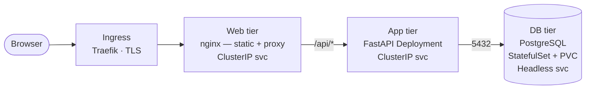

# Kubernetes Three-Tier Tutorial

A hands-on, step-by-step tutorial project to learn Kubernetes from basics to
advanced topics, running on a local Rancher Desktop cluster (k3s).

The application being deployed **is the tutorial itself**: a three-tier app where
nginx serves the tutorial UI, a Python (FastAPI) middleware tier serves step
content and tracks progress, and PostgreSQL persists which steps you've
completed. When you check off a step in the browser, you've just proven all three
tiers work end to end.

## Architecture

| Tier | Image | Source | K8s workload |
|------|-------|--------|--------------|
| Web  | `nginx:1.27` (+ baked static assets) | Public registry | Deployment |
| App  | `k8s-tutorial-app` on `python:3.12-slim` | Built locally | Deployment |
| DB   | `bitnami/postgresql` | Public registry via Helm | StatefulSet |

*Under the hood:* those pods are scheduled and kept alive by Kubernetes
itself — API server, etcd, scheduler, controller manager, and the kubelets on
each node. See [Kubernetes architecture](reference/architecture.md) for how the
control plane works and what happens when you `kubectl create`.

## Assumptions

- **Rancher Desktop on macOS** — k3s under the hood, Traefik ingress controller,
  built-in network policy enforcement. On a Rancher Manager downstream cluster,
  only [step 0.2](steps/phase-0.md#02-verify-cluster-access) and the ingress/TLS
  steps differ (flagged inline).
- PostgreSQL and nginx are pulled from public registries. The Python app is built
  locally — deliberately, since "build → deploy → iterate" is a core real-world
  skill.

!!! warning "Runtime caveat"
    Rancher Desktop defaults to `containerd`. Images built with `docker build`
    are invisible to k3s unless you switch to the `moby` engine or build with
    `nerdctl build`
    ([step 2.2](steps/phase-2.md#22-build-the-image-rancher-desktop-runtime-caveat)).

## How to use this tutorial

Work through the steps in order — each has **Goals**, **Concepts**, **Commands**,
and a **Verify** checkpoint. Start with
[Getting started](getting-started.md) to check prerequisites and scaffold the
repo, then begin at [Phase 0](steps/phase-0.md).
