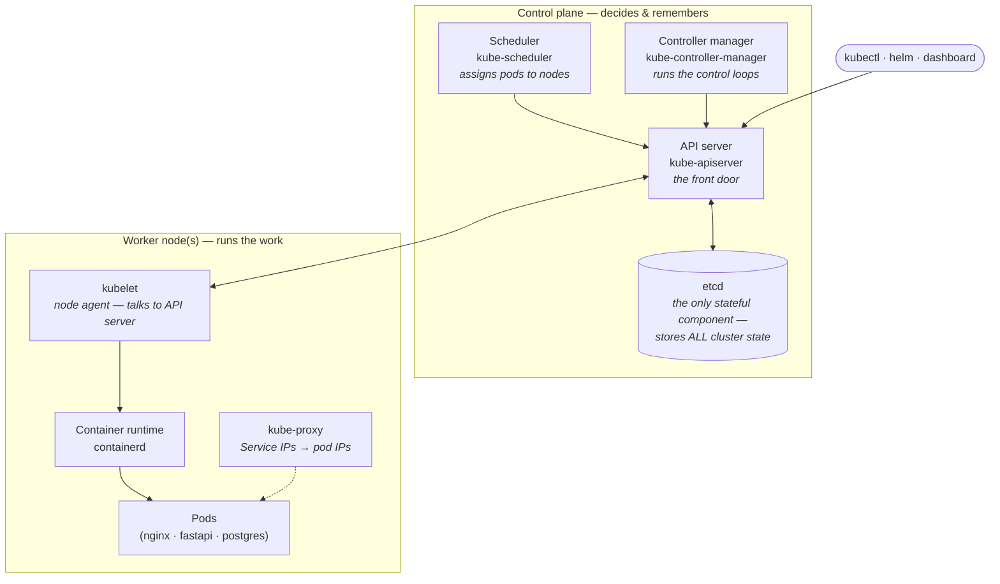
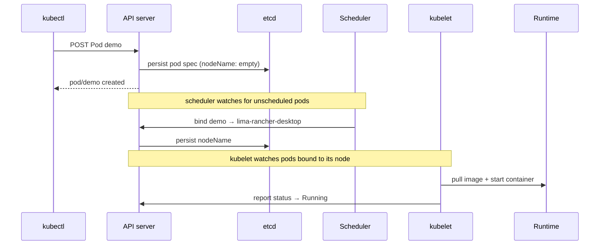

# Kubernetes Architecture

What's actually inside the cluster you connected to in step
[0.2](../steps/phase-0.md#02-verify-cluster-access). This is the *design* layer
below the three-tier app: who stores the state, who makes decisions, and who
does the work.

## The two halves — control plane and nodes

Kubernetes splits every cluster into a **control plane** (the brain — stores
state and makes decisions) and **worker nodes** (the muscle — run your pods).
On Rancher Desktop both live on one machine, but the separation still exists
logically.

## The components, one line each

| Component | Lives on | What it does | You saw it when… |
|-----------|----------|--------------|-------------------|
| **API server** | Control plane | The *only* front door — every kubectl command, every internal component talks to it. Validates and persists objects. | `kubectl` commands target it; `localhost:8080` error = can't reach it |
| **etcd** | Control plane | Distributed key-value store holding the entire cluster state (desired + observed). If it's lost, the cluster has amnesia. | It's why `get-contexts`/`use-context` matters — contexts point at *which* etcd-backed API you're mutating |
| **Scheduler** | Control plane | Watches for pods with no `nodeName`, scores nodes, binds the pod to the best fit. | `pod.spec.containers` field from `kubectl explain` — the scheduler fills in `nodeName`, not you |
| **Controller manager** | Control plane | Bundles the control loops (Deployment, StatefulSet, Job, ReplicaSet controllers…). Each watches the API, compares desired vs actual, acts. | `kubectl run` → something else created the pod; a *controller* did the work |
| **kubelet** | Every node | Agent on each node. Watches the API for pods assigned to *its* node, drives the runtime to start them, reports status back. | `STATUS` column in `get pods -w` — kubelet reporting up |
| **Container runtime** | Every node | Actually pulls images and runs containers. | `containerd` — the Rancher Desktop caveat in step 2.2 |
| **kube-proxy** | Every node | Programs routing so a Service's virtual IP fans out to pod IPs. | `svc/web` ClusterIP from phase 3 works because of this |

## What happens when you run `kubectl create`

The tutorial's `pod/demo created` message is deceptively simple — five
components coordinated to make that pod real:

Read it top to bottom as: **declare intent → persist → react**. Nobody "runs
your pod" at create time — the API server just records the *desired* state, and
downstream loops reconcile reality toward it.

## The core idea — desired state + control loops

This is the one concept everything else hangs on:

1. **You declare desired state** — "2 nginx replicas", "a Secret named
   `postgres`", written to etcd via the API server.
2. **Controllers loop forever** — watch → compare desired vs actual → act to
   close the gap. That's why deleting a pod under a Deployment gets a fresh one
   for free: the ReplicaSet controller sees `desired=1, actual=0` and creates a
   replacement.
3. **Nothing calls kubectl but you** — the cluster manages itself through the
   API. `kubectl` is just one client of many (scheduler, kubelet, controllers
   all speak to the same API server).

!!! note "k3s under Rancher Desktop"
    k3s bundles the API server, scheduler, controller manager, and embedded
    etcd into a **single process** — that's why `lima-rancher-desktop` shows
    `control-plane,master` in its `ROLES` column yet also runs your pods. In a
    production cluster these would be 3+ separate machines, and you'd point
    `get-contexts` at a remote API server instead of `127.0.0.1`.
