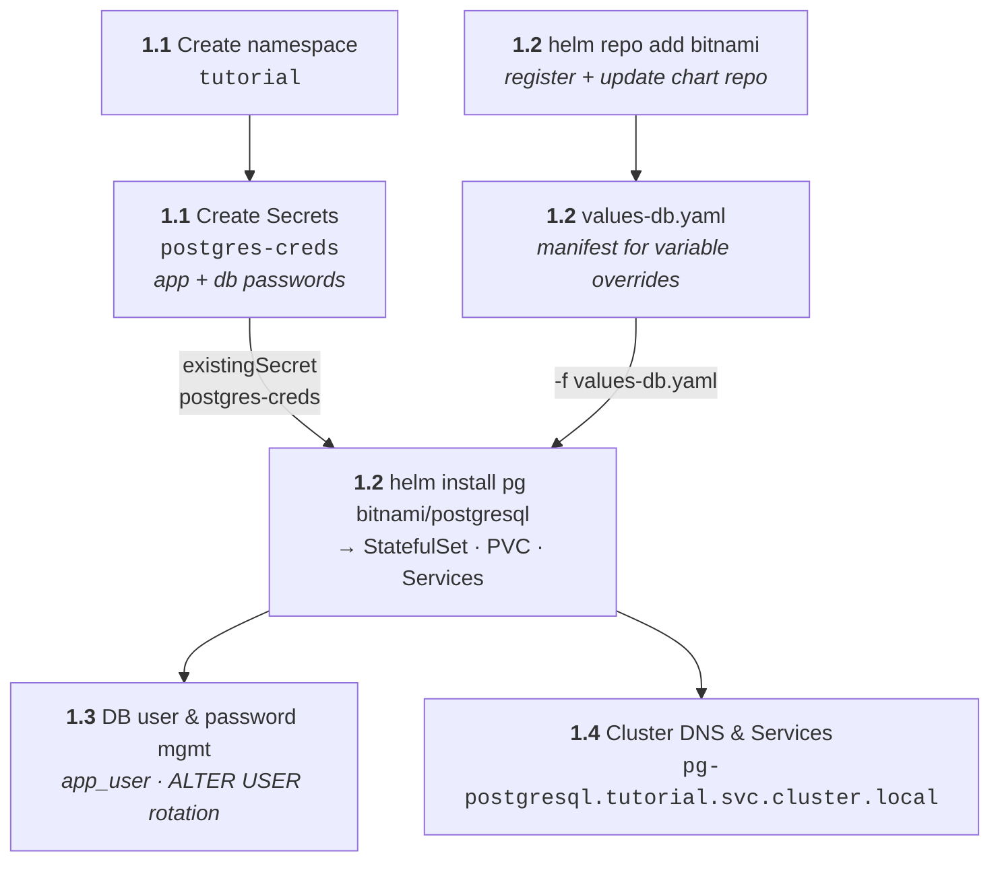

# Phase 1 — DB Tier (PostgreSQL)

What this phase builds: a namespace to hold everything, credentials as a
Secret, then PostgreSQL deployed from the Bitnami Helm chart — configured by a
values file — followed by password management and the DNS/service wiring other
tiers will use.



## 1.1 — Namespace + Secrets

**Goals:** Isolate tutorial resources; create and inspect Secrets.

**Concepts:** Namespaces, Secrets, `data` vs `stringData`, base64
(encoding ≠ encryption).

Run these in order. Expand **ⓘ Expected output** under each command to compare
with yours — the `+` markers inside the output explain every column and status.

1.  Create the tutorial namespace:

    ```bash
    kubectl create namespace tutorial
    ```

    ??? info "INFO"

        ??? question "Why?"

            all three tiers live inside `tutorial` — isolating the app from
            `default`/`kube-system` and letting you wipe everything with one
            `delete namespace` later.

        ??? info "Expected output"

            ```bash
            namespace/tutorial created          # (1)!
            ```

            1.  Same `resource/name created` confirmation pattern as 0.3.

2.  Make it the default namespace for your context:

    ```bash
    kubectl config set-context --current --namespace=tutorial
    ```

    ??? info "INFO"

        ??? question "Why?"

            from here on, plain `kubectl get pods` means *in `tutorial`* — no
            `-n` on every command. (This is the `set-context` trick from step 0.2's
            mental model.)

        ??? info "Expected output"

            ```bash
            Context "rancher-desktop" modified.     # (1)!
            ```

            1.  The `NAMESPACE` column in `kubectl config get-contexts` now shows
                `tutorial`. To undo later:
                `kubectl config set-context --current --namespace=default`.

3.  Create the database credentials as a Secret:

    ```bash
    kubectl create secret generic postgres-creds \
      --from-literal=postgres-password='SuperSecret123' \
      --from-literal=app-password='AppPass456'
    ```

    ??? info "INFO"

        ??? question "Why?"

            passwords must never live in a Pod spec or ConfigMap. A `Secret`
            keeps them out of plain manifests and lets workloads mount them.

        ??? info "Expected output"

            ```bash
            secret/postgres-creds created         # (1)!
            ```

            1.  `generic` = arbitrary key/value secrets (vs `tls` or
                `docker-registry` types). Each `--from-literal` becomes one key.

4.  Inspect the Secret as YAML:

    ```bash
    kubectl get secret postgres-creds -o yaml
    ```

    ??? info "INFO"

        ??? question "Why?"

            see how the cluster actually stores it — you'll notice the values
            look scrambled. That's base64 **encoding**, not encryption.

        ??? info "Expected output (trimmed)"

            ```yaml
            apiVersion: v1
            data:
              app-password: QXBwUGFzczQ1Ng==          # (1)!
              postgres-password: U3VwZXJTZWNyZXQxMjM=
            kind: Secret
            metadata:
              name: postgres-creds
              namespace: tutorial
            type: Opaque                              # (2)!
            ```

            1.  Base64-encoded value — `QXBwUGFzczQ1Ng==` is `AppPass456` run
                through `base64`, readable by anyone with `get secret` rights.
            2.  `Opaque` = generic key/value data — the default Secret type.

5.  Decode a secret value:

    ```bash
    kubectl get secret postgres-creds -o jsonpath='{.data.postgres-password}' | base64 -d
    ```

    ??? info "INFO"

        ??? question "Why?"

            proves the previous point — decoding is trivial, so RBAC (who may
            `get` secrets) is the real protection, not the encoding.

        ??? info "Expected output"

            ```bash
            SuperSecret123                          # (1)!
            ```

            1.  The plaintext password. `jsonpath` extracts one field; `base64 -d`
                decodes it.

6.  See how `describe` treats secrets:

    ```bash
    kubectl describe secret postgres-creds
    ```

    ??? info "INFO"

        ??? question "Why?"

            `describe` deliberately shows only key names and **sizes** — never
            values. It's safe to paste into bug reports and chat.

        ??? info "Expected output"

            ```bash
            Name:         postgres-creds
            Namespace:    tutorial
            Type:         Opaque
            Data
            ====
            postgres-password:  14 bytes             # (1)!
            app-password:       10 bytes
            ```

            1.  Byte counts only — contents stay hidden, unlike `-o yaml`.

!!! success "Verify"
    You can decode the secret — that's the point.
    Step [6.1](phase-6.md#61-secrets-encryption-at-rest) addresses real
    encryption at rest.

---

## 1.2 — Deploy PostgreSQL via Helm (Bitnami chart)

**Goals:** Deploy a production-grade chart; understand StatefulSets and
persistence.

**Concepts:** Helm repos/charts/values, StatefulSet vs Deployment, PV/PVC,
StorageClass.

1.  Register the Bitnami chart repository:

    ```bash
    helm repo add bitnami https://charts.bitnami.com/bitnami
    ```

    ??? info "INFO"

        ??? question "Why?"

            Helm installs come from chart **repos** (like apt/brew sources).
            `add` only records the URL — nothing is fetched yet.

        ??? info "Expected output"

            ```bash
            "bitnami" has been added to your repositories     # (1)!
            ```

            1.  `helm repo list` now shows it. `bitnami` is just the local alias —
                the name you chose is how you'll reference it.

2.  Fetch the repo index:

    ```bash
    helm repo update
    ```

    ??? info "INFO"

        ??? question "Why?"

            updates the local cache of available charts/versions — like
            `apt update`. Stale index = stale versions.

        ??? info "Expected output"

            ```bash
            Update Complete. ⎈Happy Helming!⎈                 # (1)!
            ```

            1.  Index downloaded. The ⎈ is Helm's ship-wheel mascot.

3.  See which chart versions exist:

    ```bash
    helm search repo bitnami/postgresql --versions | head
    ```

    ??? info "INFO"

        ??? question "Why?"

            charts version independently of the app they install — check both
            columns before picking one.

        ??? info "Expected output"

            ```bash
            NAME                  CHART VERSION   APP VERSION   DESCRIPTION       # (1)!
            bitnami/postgresql    16.x.x          17.x          PostgreSQL is ...
            bitnami/postgresql    15.x.x          16.x          ...
            ```

            1.  `CHART VERSION`: the package's own version · `APP VERSION`: the
                PostgreSQL release it deploys. Pin either with `--version`/
                `--set image.tag`.

4.  Inspect the chart metadata before installing:

    ```bash
    helm show chart bitnami/postgresql
    ```

    ??? info "INFO"

        ??? question "Why?"

            `helm show chart` prints the chart's `Chart.yaml` — the package
            manifest. It tells you what you'll get (which app version, which images,
            what it depends on) *without installing anything*.

        ??? info "Expected output (trimmed)"

            ```yaml
            apiVersion: v2                              # (1)!
            name: postgresql
            version: 18.12.4                            # (2)!
            appVersion: 18.6.0                          # (3)!
            description: PostgreSQL (Postgres) is an open source object-relational ...
            home: https://bitnami.com
            dependencies:
            - name: common
              repository: oci://registry-1.docker.io/bitnamicharts
              version: 2.41.0                           # (4)!
            annotations:
              images: |
                - name: postgresql
                  version: "18.6.0"
                  image: registry-1.docker.io/bitnami/postgresql:latest
                - name: postgres-exporter
                  version: 0.20.1
                  image: registry-1.docker.io/bitnami/postgres-exporter:latest
                - name: os-shell
                  version: "5"
                  image: registry-1.docker.io/bitnami/os-shell:latest
            maintainers:
            - name: Broadcom, Inc. All Rights Reserved.
              url: https://github.com/bitnami/charts
            sources:
            - https://github.com/bitnami/charts/tree/main/bitnami/postgresql
            ```

            1.  `v2` = Helm 3 chart format.
            2.  Chart (package) version — the thing `--version` pins.
            3.  `appVersion` = the PostgreSQL release it deploys — matches the
                `APP VERSION` column in `helm search`.
            4.  The chart depends on Bitnami's `common` library chart, pulled from
                an **OCI registry** — Helm will fetch it automatically at install.
            5.  The `images` annotation lists every image the chart can pull —
                useful for air-gapped/proxy environments where you must mirror
                them yourself.

5.  Dump the chart's default values:

    ```bash
    helm show values bitnami/postgresql | less
    ```

    ??? info "INFO"

        ??? question "Why?"

            this is how you **discover what `values-db.yaml` can override**.
            `helm show values` prints every tunable key with the chart's defaults and
            inline `@param` docs — your `-f` file is just a sparse subset of this.

        ??? info "Expected output (trimmed)"

            ```yaml
            auth:
              database: ""                              # (1)!
              existingSecret: ""                        # (2)!
              postgresPassword: ""
            primary:
              persistence:
                enabled: true
                size: 8Gi                               # (3)!
            ```

            1.  We override to `auth.database: tutorial`.
            2.  `existingSecret: postgres-creds` — points the chart at the Secret
                from step 1.1 instead of generating a random password.
            3.  We shrink `primary.persistence.size` to `1Gi` for a local cluster.

6.  Create the values file:

    ```bash
    cat > deploy/manifests/db/values-db.yaml <<'EOF'
    auth:
      database: tutorial
      existingSecret: postgres-creds
    primary:
      persistence:
        size: 1Gi
    EOF
    ```

    ??? info "INFO"

        ??? question "Why?"

            a values file is how you tell a chart *how* to install — your
            overrides on top of its defaults. You don't have to know the keys: each
            one below was picked straight out of the `helm show values` output above.
            (The tutorial repo ships this file, so if you cloned it, it's already at
            `deploy/manifests/db/values-db.yaml` — otherwise create it here.)

        ??? info "What each key does — and where it came from"

            | Key | Effect | Found via |
            |-----|--------|-----------|
            | `auth.database` | database created on first boot | `helm show values` → `auth:` section |
            | `auth.existingSecret` | read the admin password from the 1.1 Secret instead of generating a random one — the chart looks for a `postgres-password` key in it | `helm show values` → `auth.existingSecret` |
            | `primary.persistence.size` | shrink the 8Gi default to 1Gi for a local cluster | `helm show values` → `primary.persistence` |

            No file created? No problem — the same keys could be passed inline as
            `--set auth.database=tutorial --set auth.existingSecret=postgres-creds …`,
            but a file is repeatable, reviewable, and commit-able.

7.  Install the chart into `tutorial` with your values file:

    ```bash
    helm install pg bitnami/postgresql -n tutorial -f deploy/manifests/db/values-db.yaml
    ```

    ??? info "INFO"

        ??? question "Why?"

            `helm install` creates a **release** (`pg`). Breaking the command
            down — `bitnami/postgresql` is `repo-alias/chart-name`: Helm looks up
            `bitnami` in the repo index you added (`helm repo add`) and refreshed
            (`helm repo update`), downloads the `.tgz`, then renders the chart's
            templates with three layers of values merged in order — chart defaults ←
            `-f deploy/manifests/db/values-db.yaml` ← any `--set` flags.

        ??? info "Expected output (trimmed)"

            ```bash
            NAME: pg
            LAST DEPLOYED: ...
            NAMESPACE: tutorial
            STATUS: deployed                             # (1)!
            REVISION: 1                                  # (2)!
            NOTES: ...
            ```

            1.  `deployed` = the release was recorded — pods may still be
                starting. Not the same as "ready".
            2.  Every `helm upgrade` bumps `REVISION` — that's how Helm tracks
                release history for rollbacks.

8.  Check what the chart actually created:

    ```bash
    kubectl get statefulset,pods,pvc -n tutorial
    ```

    ??? info "INFO"

        ??? question "Why?"

            the chart emits several object kinds at once — StatefulSet, pod,
            and PVC. Seeing all three side by side is the persistence story.

        ??? info "Expected output"

            ```bash
            NAME                             READY   AGE
            statefulset.apps/pg-postgresql   1/1     2m     # (1)!

            NAME                   READY   STATUS    RESTARTS   AGE
            pod/pg-postgresql-0    1/1     Running   0          2m   # (2)!

            NAME                                    STATUS   VOLUME     CAPACITY
            persistentvolumeclaim/data-pg-postgresql-0   Bound   pvc-...   1Gi   # (3)!
            ```

            1.  A **StatefulSet**, not a Deployment — databases need stable
                identity and ordered startup.
            2.  `pg-postgresql-0` — the `-0` ordinal is the StatefulSet signature:
                the name survives restarts, unlike Deployment pods' random suffix.
            3.  `Bound` = a PersistentVolume was provisioned and attached. The
                claim name embeds the pod name — each replica gets its own volume.

        ??? failure "Got `arguments in resource/name form must have a single resource and name`?"

            You typed spaces after the commas:

            ```bash
            kubectl get statefulset, pods, pvc   # ✗ — `pods` and `pvc` are read
                                               #    as NAMES of statefulsets
            ```

            Comma-separated resource types must be **one word** — spaces start a
            new argument, and kubectl then thinks you asked for a statefulset
            literally named `pods`. Correct form (no spaces):

            ```bash
            kubectl get statefulset,pods,pvc -n tutorial
            ```

        ??? note "Why doesn't `kubectl get all` show the PVC?"

            `get all` is misleadingly named — it's a **fixed alias** for a subset
            of workload types only:

            `pods, services, daemonsets, deployments, replicasets, statefulsets, jobs, cronjobs`

            PVCs, Secrets, ConfigMaps, Ingresses, Roles — everything else — are
            silently excluded. There is no built-in "list literally everything";
            you either name the types explicitly (as in this command) or query
            `api-resources` for the full catalog. Rule: `get all` for a quick
            workload overview, explicit types when you need storage/config/RBAC.

9.  Trace where the data physically lives:

    ```bash
    kubectl describe pvc data-pg-postgresql-0
    ```

    ??? info "INFO"

        ??? question "Why?"

            the PVC is the pod's contract with storage. `describe` shows which
            volume and which provisioner satisfied it.

        ??? info "Expected output (trimmed)"

            ```bash
            Name:          data-pg-postgresql-0
            Status:        Bound
            Volume:        pvc-4f9b...                       # (1)!
            Access Modes:  RWO                               # (2)!
            StorageClass:  local-path                        # (3)!
            ```

            1.  The actual PersistentVolume backing the claim.
            2.  `RWO` = ReadWriteOnce — one node mounts it at a time. Fine for
                a single DB pod.
            3.  k3s' built-in provisioner — it just makes a directory on the node.
                In the cloud this would be an EBS/GCE disk instead.

10. Check the release health from Helm's side:

    ```bash
    helm status pg
    ```

    ??? info "INFO"

        ??? question "Why?"

            kubectl shows objects; `helm status` shows the *release* — its
            state, revision, and the chart's post-install notes.

        ??? info "Expected output (trimmed)"

            ```bash
            NAME: pg
            STATUS: deployed
            REVISION: 1
            NOTES: ...                                     # (1)!
            ```

            1.  The chart's own usage notes (connection strings, password
                hints). Read them — chart authors put important gotchas here.

11. See your effective configuration:

    ```bash
    helm get values pg -n tutorial
    ```

    ??? info "INFO"

        ??? question "Why?"

            shows what your `-f` file actually overrode vs the chart's
            hundreds of defaults.

        ??? info "Expected output"

            ```yaml
            USER-SUPPLIED VALUES:
            auth:
              database: tutorial
              existingSecret: postgres-creds        # (1)!
            primary:
              persistence:
                size: 1Gi
            ```

            1.  Tells the chart to read the password from your Secret instead
                of generating one. Add `-a` to see *all* values including
                defaults.

!!! success "Verify"
    `pg-postgresql-0` is Running; PVC is `Bound`. Understand why a StatefulSet
    (stable pod name, ordered startup, per-pod storage) instead of a Deployment.

---

## 1.3 — DB user & password management

**Goals:** Create a least-privilege app user; learn credential handling.

**Concepts:** exec into pods, Postgres roles/grants, superuser vs app user,
rotation.

1.  Open a psql shell inside the DB pod:

    ```bash
    kubectl exec -it pg-postgresql-0 -- psql -U postgres -d tutorial
    ```

    ??? info "INFO"

        ??? question "Why?"

            the DB isn't exposed outside the cluster — `exec` is how you
            administer it in place.

        ??? info "Expected output"

            ```bash
            psql (17.x)
            Type "help" for help.

            tutorial=#                                # (1)!
            ```

            1.  `=#` — the `#` prompt means you're connected as a **superuser**
                (`postgres`). A regular user gets `=>`. Everything you run now is
                inside the pod, not your machine.

2.  Create the least-privilege app user and the `progress` table — paste this
    into the psql session:

    ```sql
    CREATE USER app_user WITH PASSWORD 'AppPass456';
    GRANT CONNECT ON DATABASE tutorial TO app_user;
    GRANT USAGE ON SCHEMA public TO app_user;
    CREATE TABLE progress (
      step INT PRIMARY KEY,
      done BOOLEAN DEFAULT false,
      ts TIMESTAMPTZ DEFAULT now()
    );
    GRANT SELECT, INSERT, UPDATE ON progress TO app_user;
    \l        -- list databases
    \du       -- list users/roles
    \dt       -- list tables
    \q
    ```

    ??? info "INFO"

        ??? question "Why?"

            the app tier only needs to read/write one table. Superuser for the
            app would make any app bug or SQL injection catastrophic.

        ??? info "Expected output"

            ```text
            CREATE ROLE                               # (1)!
            GRANT
            GRANT
            CREATE TABLE
            GRANT                                     # (2)!
            ```

            1.  `CREATE ROLE` — users *are* roles in Postgres.
            2.  Then `\l` lists `tutorial`, `\du` shows both `postgres` and
                `app_user`, `\dt` shows `progress`. `\q` exits.

3.  Rotation drill — change the password **inside Postgres** first:

    ```bash
    kubectl exec -it pg-postgresql-0 -- psql -U postgres -d tutorial -c \
      "ALTER USER postgres WITH PASSWORD 'NewSecret'; \
       ALTER USER app_user WITH PASSWORD 'NewAppPass';"
    ```

    ??? info "INFO"

        ??? question "Why?"

            **The purpose:** password rotation is routine ops — credentials leak,
            expire, or policy forces periodic change. This drills the exact
            workflow you'll use for real.

            **The subtlety:** the Secret's `postgres-password` only *seeds* the
            database on **first boot** (when the PVC/data dir is empty). Postgres
            stores real credentials in its own catalog (`pg_authid`) — a Secret
            update does **not** change them. Restarting the pod with a new env
            var value won't rotate the DB password; Bitnami even logs a
            "password differs from the one persisted" warning when they diverge.

            So a real rotation starts where the password actually lives — inside
            the database.

        ??? info "Expected output"

            ```bash
            Password for user postgres:                  # (1)!
            ALTER ROLE                                   # (2)!
            ALTER ROLE
            ```

            1.  psql prompts for the **current** password — the pod enforces
                auth even on the local socket. `-it` is what lets the prompt
                reach your terminal; type `SuperSecret123` (nothing echoes).
            2.  One `ALTER ROLE` per user — the password hashes in `pg_authid`
                are updated. Old passwords stop working **immediately**.

        ??? failure "Got `fe_sendauth: no password supplied`?"

            You ran `exec` **without `-it`** — psql tried to prompt for the
            password, but with no terminal attached it can't read one:

            ```bash
            kubectl exec pg-postgresql-0 -- psql -U postgres ...   # ✗
            ```

            Two fixes: keep `-it` and answer the prompt, or pass it
            non-interactively through the container's own env var:

            ```bash
            kubectl exec pg-postgresql-0 -- sh -c \
              'PGPASSWORD="$POSTGRES_PASSWORD" psql -U postgres -d tutorial -c "ALTER ..."'
            ```

            (Mind the trap: once the Secret is updated *and* the pod restarted,
            `$POSTGRES_PASSWORD` already holds the new password — authenticate
            with whatever the DB currently holds.)

4.  Sync the Secret to match the new passwords:

    ```bash
    kubectl create secret generic postgres-creds \
      --from-literal=postgres-password='NewSecret' \
      --from-literal=app-password='NewAppPass' \
      --dry-run=client -o yaml | kubectl apply -f -
    ```

    ??? info "INFO"

        ??? question "Why?"

            The Secret is still the *declared* state — the chart and any
            future pod specs read from it. If it stays stale, the next fresh
            install (empty PVC) seeds the old password, and the env vars
            handed to the pod diverge from the DB — a confusing drift.
            Update the spec to match reality.

            **Why this construction:** `kubectl create secret` alone would
            fail — the Secret already exists (`AlreadyExists`; `create`
            isn't idempotent). And `kubectl edit` means hand-juggling
            base64. The fix:

            1. `--dry-run=client -o yaml` — render the Secret to YAML
               **locally**, without touching the cluster
               (`--dry-run=server` would validate against the API instead).
            2. `| kubectl apply -f -` — apply does **create-or-update**
               (upsert): creates if missing, patches if present. This is the
               imperative→declarative bridge — `create` renders the spec,
               `apply` persists it.
            3. No manifest file needed — which matters, because Secrets
               shouldn't sit in files or git anyway.

        ??? info "Expected output"

            ```bash
            Warning: resource secrets/postgres-creds is missing the
            kubectl.kubernetes.io/last-applied-configuration annotation ... # (1)!
            The missing annotation will be patched automatically.
            secret/postgres-creds configured          # (2)!
            ```

            1.  Expected on the **first** apply over an imperatively-created
                object — see the warning dropdown below.
            2.  `configured` (not `created`) = the object existed and was
                updated in place.

        ??? warning "Why the `last-applied-configuration` warning?"

            `kubectl apply` does a **three-way merge**: it diffs your input,
            the live object, and the `last-applied-configuration` annotation
            — which records what *you* last declared, so it can tell your
            changes apart from defaults and other actors. Objects created
            imperatively (like our step-1.1 `kubectl create secret`) have no
            such annotation, so apply warns and writes it in for you.

            Harmless — it only appears once. From now on the annotation
            exists and subsequent applies merge cleanly. This is also why
            the rule exists: *"only `apply` objects that were created
            declaratively"* — mixing imperative writes with apply is exactly
            what produces this class of warning.

5.  Restart the DB pod:

    ```bash
    kubectl rollout restart statefulset/pg-postgresql
    ```

    ??? info "INFO"

        ??? question "Why?"

            Pods snapshot env-var secrets at startup — the running pod still has
            the *old* `POSTGRES_PASSWORD` in its environment. `rollout restart`
            cycles it so spec and runtime agree. Because you already rotated the
            password *inside* Postgres (step 3), nothing breaks — whereas
            restarting with a mismatched env var is exactly when the Bitnami
            "passwords diverge" warning would appear in the pod logs.

        ??? info "Expected output"

            ```bash
            statefulset.apps/pg-postgresql restarted  # (1)!
            ```

            1.  The pod is recreated one at a time (StatefulSets are ordered).
                `kubectl get pods -w` shows the `Terminating` → `Running` cycle.

!!! success "Verify"
    Connect as `app_user` and confirm it can write `progress` but not create
    tables. After the rotation drill, `psql -U postgres` with the **old**
    password should fail and `NewSecret` should work — proof the rotation
    happened in the DB, not just the Secret. Rule: **the app tier never uses
    superuser credentials.**

---

## 1.4 — Cluster DNS & Services

**Goals:** Understand how pods find each other.

**Concepts:** ClusterIP service types, DNS naming
`svc.namespace.svc.cluster.local`, headless services.

1.  List the services Helm created:

    ```bash
    kubectl get svc -n tutorial
    ```

    ??? info "INFO"

        ??? question "Why?"

            the chart made two services — a normal ClusterIP and a headless
            one. Seeing both is the point.

        ??? info "Expected output"

            ```bash
            NAME                 TYPE        CLUSTER-IP     PORT(S)
            pg-postgresql        ClusterIP   10.43.x.x      5432/TCP   # (1)!
            pg-postgresql-hl     ClusterIP   None           5432/TCP   # (2)!
            ```

            1.  Stable virtual IP fronting the postgres pod(s) — apps connect to
                *this*, never a pod IP.
            2.  `CLUSTER-IP: None` = **headless** — DNS returns the pod IPs
                directly instead of a VIP. StatefulSets use it so clients reach a
                specific replica.

2.  Resolve the service name from inside the cluster:

    ```bash
    kubectl run dnsutils --image=busybox:1.36 --rm -it --restart=Never -- \
      nslookup pg-postgresql.tutorial.svc.cluster.local
    ```

    ??? info "INFO"

        ??? question "Why?"

            proves cluster DNS works — `nslookup` from a throwaway pod queries
            the same CoreDNS every pod uses.

        ??? info "Expected output"

            ```bash
            Server:    10.43.0.10                          # (1)!
            Address 1: 10.43.0.10 kube-dns.kube-system.svc.cluster.local

            Name:      pg-postgresql.tutorial.svc.cluster.local
            Address 1: 10.43.x.x                           # (2)!
            ```

            1.  `10.43.0.10` — CoreDNS, the cluster's DNS server.
            2.  Resolves to the service's ClusterIP.
            3.  `--rm` deletes the pod on exit — nothing left to clean up.

        ??? note "Where does that DNS name come from?"

            You don't look it up — you **construct** it from a fixed pattern:

            ```text
            <service>.<namespace>.svc.cluster.local
            └─ item 1    └─ you created   └─ same for every cluster
              output       it (1.1)
            ```

            - **`<service>`** — the `NAME` column from step 1:
              `kubectl get svc -n tutorial` → `pg-postgresql`
            - **`<namespace>`** — `tutorial`, where the service lives
            - **`.svc.cluster.local`** — the cluster's baked-in DNS suffix;
              `svc` marks it as a Service record

            And you rarely need the full form — every pod's
            `/etc/resolv.conf` (written by kubelet) carries `search` domains,
            so inside a pod `pg-postgresql` (same namespace) or
            `pg-postgresql.tutorial` (cross-namespace) resolve automatically.
            The FQDN is only needed when the caller lives in a *different*
            namespace — which is exactly the web/app tiers' case later.

        ??? failure "Got `timed out waiting for the condition` + pod deleted?"

            Two likely causes — check your command first:

            1. **Missing `--` on `--restart=Never`** — typing `restart=Never`
               without dashes makes kubectl treat it as a bare argument, so
               the pod gets the default `restartPolicy: Always`. busybox runs
               `nslookup`, exits, restarts, `CrashLoopBackOff` — and
               `--rm -it` never gets a running container to attach to:
               timeout, then the pod is deleted.
            2. **Slow image pull** — the first `busybox:1.36` pull can exceed
               the attach timeout. Retry the command (image is cached now),
               or watch `kubectl get pods -w` to see `ContainerCreating`.

            Corrected form:

            ```bash
            kubectl run dnsutils --image=busybox:1.36 --rm -it \
              --restart=Never -- nslookup pg-postgresql.tutorial.svc.cluster.local
            ```

3.  See which pods sit behind the service:

    ```bash
    kubectl get endpoints pg-postgresql
    ```

    ??? info "INFO"

        ??? question "Why?"

            a Service doesn't hold pods — it holds an **Endpoints** list that
            controllers keep in sync with Ready pods. This is the wiring.

        ??? info "Expected output"

            ```bash
            NAME            ENDPOINTS          AGE
            pg-postgresql   10.42.0.x:5432     5m         # (1)!
            ```

            1.  The *pod* IP, not the service IP — traffic flows Service VIP →
                endpoint → pod. Empty `ENDPOINTS` would mean no Ready pods match
                the selector.

!!! success "Verify"
    DNS resolves the service name; endpoints match the postgres pod IP
    (compare with `kubectl get pod pg-postgresql-0 -o wide`).
