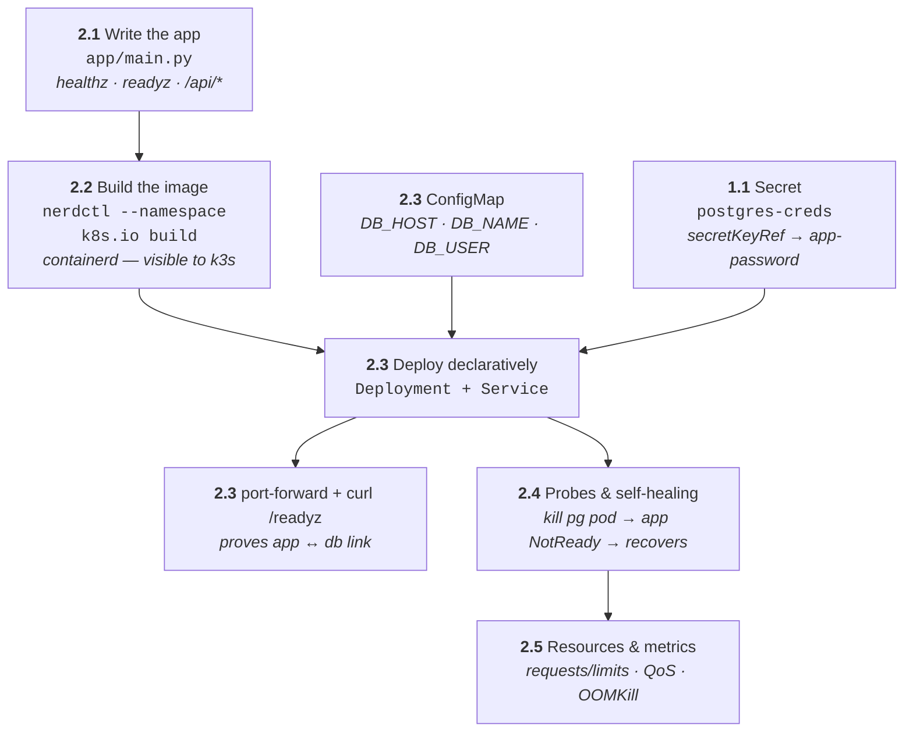

# Phase 2 — App Tier (Python / FastAPI)

What this phase builds: the FastAPI middleware that sits between the web tier
and Postgres — written, built into a local image, deployed declaratively with
config and secrets wired in, then hardened with probes and resource limits.



## 2.1 — Write the app

**Goals:** Build `app/main.py` — the middleware that talks to Postgres.

**Concepts:** Environment-driven config, health vs readiness semantics, `uv`
project workflow.

The app simulates the tutorial itself: it serves the curriculum as JSON and
tracks per-step completion in the `progress` table — checking off a step in
the web UI is the end-to-end proof all three tiers work. Dependencies are
managed by **uv** (`pyproject.toml` + `uv.lock`): FastAPI, pydantic,
pydantic-settings, psycopg.

Endpoints:

- `GET /healthz` — process alive (always 200)
- `GET /readyz` — runs `SELECT 1` against Postgres; fails if DB unreachable
- `GET /api/steps` — tutorial steps joined with completion state
- `GET /api/progress`, `POST /api/progress` — read/write the `progress` table

Config via env: `DB_HOST`, `DB_NAME`, `DB_USER`, `DB_PASSWORD` (from Secret).

The repo ships `app/main.py`, `pyproject.toml`, `uv.lock`, and a `Dockerfile`
— try it locally first:

1.  Install dependencies into a project venv:

    ```bash
    cd app && uv sync
    ```

    ??? info "INFO"

        ??? question "Why?"

            `uv sync` reads `uv.lock` and creates `.venv` with the exact
            pinned versions — same dependency set the Dockerfile installs.

        ??? info "Expected output"

            ```bash
            Resolved 25 packages ...
            Installed 25 packages in ...        # (1)!
            ```

            1.  Reproducible — `uv.lock` pins every transitive dep, like
                `Chart.lock` does for Helm.

2.  Run the app locally:

    ```bash
    uv run uvicorn main:app --reload --port 8000
    ```

    ??? info "INFO"

        ??? question "Why?"

            `uv run` executes inside the project venv without activating it;
            `--reload` restarts on file changes — the inner dev loop before
            any image builds.

        ??? info "Expected output"

            ```bash
            INFO:     Uvicorn running on http://127.0.0.1:8000   # (1)!
            INFO:     Application startup complete.
            ```

            1.  Serving locally. `/healthz` works standalone; `/readyz` and
                `/api/*` need Postgres — `kubectl port-forward
                svc/pg-postgresql 5432:5432` and `DB_HOST=localhost` bridges
                the running cluster DB to your local process.

3.  Sanity-check it:

    ```bash
    curl localhost:8000/healthz
    ```

    ??? info "INFO"

        ??? info "Expected output"

            ```bash
            {"status":"ok"}                         # (1)!
            ```

            1.  Same response shape the kubelet's liveness probe will check
                in step 2.4.

---

## 2.2 — Build the image (Rancher Desktop runtime caveat)

**Goals:** Get a locally-built image visible to k3s.

**Concepts:** Image build/push/pull lifecycle, `imagePullPolicy`, runtime
namespaces.

Run these in order. Expand **ⓘ INFO** under each command for the rationale and
expected output — the `+` markers explain every column and status.

1.  Build the app image into the **containerd** namespace k3s uses:

    ```bash
    nerdctl --namespace k8s.io build -t k8s-tutorial-app:0.1.0 ./app
    ```

    ??? info "INFO"

        ??? question "Why?"

            Rancher Desktop's default runtime is **containerd**, which keeps
            images per-namespace — k3s reads the `k8s.io` namespace.
            `docker build` (or even `nerdctl` without `--namespace`) builds
            into a different store, so the cluster would never see the image
            and pods would hit `ImagePullBackOff`. `--namespace k8s.io` puts
            the build where the cluster actually looks.

        ??? info "Expected output (trimmed)"

            ```bash
            [+] Building 12.3s (10/10) FINISHED             # (1)!
             => exporting to oci image format
            unpackaging linux/arm64/v8 ...                   # (2)!
            ```

            1.  Buildkit progress — layers cached on rebuilds, so second runs
                are near-instant.
            2.  `unpackaging …` = the image landing in containerd's `k8s.io`
                namespace — the step that makes it visible to k3s.

        ??? note "On the moby/dockerd runtime instead?"

            If Rancher Desktop is set to **dockerd (moby)** instead of
            containerd, build normally — docker images are shared with k3s in
            that mode:

            ```bash
            docker build -t k8s-tutorial-app:0.1.0 ./app
            ```

2.  Confirm the image landed where the cluster can see it:

    ```bash
    nerdctl --namespace k8s.io images | grep k8s-tutorial
    ```

    ??? info "INFO"

        ??? question "Why?"

            sanity-checks the previous step before Kubernetes gets involved —
            if the tag shows here, `imagePullPolicy: IfNotPresent` in the
            Deployment will resolve it locally without touching a registry.

        ??? info "Expected output"

            ```bash
            k8s-tutorial-app    0.1.0    <image-id>    <size>   # (1)!
            ```

            1.  Image tagged `0.1.0` inside the `k8s.io` namespace. Empty
                output = wrong namespace or the build didn't finish.

!!! success "Verify"
    `imagePullPolicy: IfNotPresent` + local tag → k8s uses the node-local image.
    Later: `docker push` to Docker Hub/GHCR for the real registry flow.

---

## 2.3 — Deployment + ConfigMap + Secret wiring

**Goals:** Deploy the app tier declaratively; separate config from code from
secrets.

**Concepts:** Deployment/ReplicaSet/pod hierarchy, `envFrom`/`secretKeyRef`,
`kubectl apply`, labels/selectors.

This step applies three manifests:

```yaml
# deploy/manifests/app/configmap.yaml:   DB_HOST=pg-postgresql, DB_NAME=tutorial, DB_USER=app_user
# deploy/manifests/app/deployment.yaml:  env secretKeyRef → postgres-creds / app-password
# deploy/manifests/app/service.yaml:     ClusterIP :8000
```

1.  Apply the app manifests:

    ```bash
    kubectl apply -f deploy/manifests/app/
    ```

    ??? info "INFO"

        ??? question "Why?"

            the first **declarative** deploy — a directory of YAML becomes
            the desired state, and `apply` create-or-updates each object.
            Non-secret config lands in the ConfigMap (`DB_HOST`, `DB_NAME`,
            `DB_USER`); the password comes from the `postgres-creds` Secret
            via `secretKeyRef` — config separated from secrets, both
            separated from code.

        ??? info "Expected output"

            ```bash
            configmap/app-config created
            deployment.apps/app created                # (1)!
            service/app created
            ```

            1.  `apply` on a directory creates each manifest — note the three
                kinds: ConfigMap, Deployment, Service.

2.  Watch the rollout reach readiness:

    ```bash
    kubectl rollout status deploy/app
    ```

    ??? info "INFO"

        ??? question "Why?"

            `apply` returns after the *spec* is accepted, not after pods are
            healthy — `rollout status` blocks until the Deployment reports
            Ready, and is where a bad image or env var surfaces immediately
            (it hangs instead of silently failing).

        ??? info "Expected output"

            ```bash
            Waiting for deployment "app" rollout to finish: ...   # (1)!
            deployment "app" successfully rolled out              # (2)!
            ```

            1.  Transient line while ReplicaSet pods come up — a *stuck* one
                here means CrashLoopBackOff or pending pods; check
                `get pods`/`describe` next.
            2.  All replicas updated and Ready.

3.  See the pods the Deployment owns:

    ```bash
    kubectl get pods -l tier=app -o wide
    ```

    ??? info "INFO"

        ??? question "Why?"

            `-l tier=app` filters by the label the manifests set — labels are
            how Deployments, Services, and NetworkPolicies find their pods.
            `-o wide` adds IPs and the node.

        ??? info "Expected output"

            ```bash
            NAME                  READY   STATUS    RESTARTS   AGE   IP          NODE
            app-6d8f9c…           1/1     Running   0          1m    10.42.0.x   lima-rancher-desktop  # (1)!
            ```

            1.  Random suffix = ReplicaSet-managed pod name (contrast with
                the StatefulSet's stable `-0` ordinal).

4.  Follow the app logs:

    ```bash
    kubectl logs -f deploy/app
    ```

    ??? info "INFO"

        ??? question "Why?"

            `logs deploy/app` follows the *Deployment* — kubectl picks a pod
            from it, so you don't chase random pod names. `-f` streams new
            lines live.

        ??? info "Expected output"

            ```bash
            INFO:     Started server process
            INFO:     Uvicorn running on http://0.0.0.0:8000      # (1)!
            ```

            1.  FastAPI/Uvicorn banner — the app is serving inside the pod.

5.  Bridge the service to localhost:

    ```bash
    kubectl port-forward svc/app 8000:8000 &
    ```

    ??? info "INFO"

        ??? question "Why?"

            `port-forward` tunnels `localhost:8000` through the API server
            straight to the Service — no ingress needed. `&` backgrounds it
            so the terminal stays free (kill it later with `kill %1` or
            `jobs`/`fg`).

        ??? info "Expected output"

            ```bash
            Forwarding from 127.0.0.1:8000 -> 8000    # (1)!
            ```

            1.  Tunnel is live; keep the shell open or it dies with the
                process.

6.  Prove the app↔DB link end to end:

    ```bash
    curl localhost:8000/readyz
    ```

    ??? info "INFO"

        ??? question "Why?"

            `/readyz` executes `SELECT 1` against Postgres — a `200` with
            `{"db":"ok"}` traverses *everything*: port-forward → Service →
            app pod → DNS (`pg-postgresql` service) → DB pod.

        ??? info "Expected output"

            ```bash
            {"db":"ok"}                               # (1)!
            ```

            1.  DB reachable through the service DNS name — the first real
                cross-tier proof.

7.  Bonus — logs from a *previous* container instance:

    ```bash
    kubectl logs deploy/app --previous
    ```

    ??? info "INFO"

        ??? question "Why?"

            after a crash-restart, current logs show only the new container —
            `--previous` gets the dead one's output, which is where the
            actual crash reason lives.

        ??? info "Expected output"

            The crashed container's last lines — or `Error from server
            (BadRequest): previous terminated container ... not found` if the
            pod never restarted. That error is *good news*: it means no
            crash happened.

!!! success "Verify"
    `/readyz` returns DB-connected JSON through the port-forward.

---

## 2.4 — Probes & self-healing

**Goals:** Make k8s detect and route around failure.

**Concepts:** readiness vs liveness vs startup probes, `restartPolicy`, events.

1.  See the probes the Deployment defines:

    ```bash
    kubectl describe pod -l tier=app | grep -A5 -i probes
    ```

    ??? info "INFO"

        ??? question "Why?"

            probes are declared in the pod spec — `describe` shows what
            kubelet checks (readiness gates Service traffic; liveness
            restarts the container).

        ??? info "Expected output (trimmed)"

            ```bash
            Liveness:   http-get /healthz delay=…  period=10s   # (1)!
            Readiness:  http-get /readyz  delay=…  period=5s    # (2)!
            ```

            1.  Liveness failing → kubelet *restarts* the container.
            2.  Readiness failing → pod drops out of Service endpoints but
                keeps running — the distinction the next commands exploit.

2.  Chaos test — kill the database pod:

    ```bash
    kubectl delete pod pg-postgresql-0
    ```

    ??? info "INFO"

        ??? question "Why?"

            a controlled failure to *watch* the self-healing chain: DB pod
            dies → app's `/readyz` starts failing → app goes `NotReady` and
            exits endpoints → StatefulSet recreates `pg-postgresql-0` → app
            recovers. No human touched the app.

        ??? info "Expected output"

            ```bash
            pod "pg-postgresql-0" deleted             # (1)!
            ```

            1.  The StatefulSet controller immediately starts a replacement
                with the *same* name — ordered, stable identity in action.

3.  Watch readiness flip in real time:

    ```bash
    kubectl get pods -w
    ```

    ??? info "INFO"

        ??? question "Why?"

            `-w` streams the transition — `app` goes `0/1 Ready` (can't serve
            without its DB) while `pg-postgresql-0` recreates.

        ??? info "Expected output"

            ```bash
            pg-postgresql-0   1/1   Terminating   0   10m       # (1)!
            app-…             0/1   Running       0   5m        # (2)!
            pg-postgresql-0   0/1   Running       0   3s
            app-…             1/1   Running       0   6m        # (3)!
            ```

            1.  DB pod terminating.
            2.  App `0/1` — *running but NotReady*: readiness probe failing
                removes it from endpoints without restarting it.
            3.  Both back — recovery is automatic.

4.  Read the story via events:

    ```bash
    kubectl get events --sort-by=.lastTimestamp
    ```

    ??? info "INFO"

        ??? question "Why?"

            events are the cluster's narration — kill, reschedule, probe
            failures, recovery — sorted chronologically to read as a
            timeline.

        ??? info "Expected output (trimmed)"

            ```bash
            Normal   Killing           pod/pg-postgresql-0   Stopping container  # (1)!
            Warning  Unhealthy         pod/app-…             Readiness probe failed
            Normal   Started           pod/pg-postgresql-0   Started container
            Normal   …                 endpoints/app         (endpoints updated)   # (2)!
            ```

            1.  The kill lands first.
            2.  Readiness failures, then endpoint re-add — the full loop.

!!! success "Verify"
    App pod returns to `Ready` automatically once postgres is back. Readiness
    removes it from Service endpoints — traffic never hits a broken pod.

---

## 2.5 — Resources & metrics

**Goals:** Right-size workloads; observe actual usage.

**Concepts:** requests vs limits, QoS classes (Guaranteed/Burstable/BestEffort),
OOMKill, metrics-server.

1.  Read actual CPU/memory usage:

    ```bash
    kubectl top nodes && kubectl top pods -n tutorial
    ```

    ??? info "INFO"

        ??? question "Why?"

            `top` reads live metrics from **metrics-server** — the real
            usage, vs the *declared* requests/limits in the spec. The gap
            between the two is how you right-size.

        ??? info "Expected output"

            ```bash
            NAME                   CPU(cores)   MEMORY(bytes)     # (1)!
            lima-rancher-desktop   210m         1250Mi
            NAME                   CPU(cores)   MEMORY(bytes)
            app-…                  3m           45Mi              # (2)!
            pg-postgresql-0        15m          120Mi
            ```

            1.  `m` = millicores (1000m = 1 CPU); `Mi` = mebibytes.
            2.  Actual usage is usually far below requests — that slack is
                what limits are for. `metrics-server` missing →
                `error: Metrics API not available` (Rancher Desktop ships it).

2.  Check the pod's QoS class:

    ```bash
    kubectl describe pod -l tier=app | grep QoS
    ```

    ??? info "INFO"

        ??? question "Why?"

            QoS class derives from requests/limits: **Guaranteed** (equal
            req=limit on every resource) > **Burstable** (some set) >
            **BestEffort** (none). Under node pressure, eviction order is
            BestEffort → Burstable → Guaranteed.

        ??? info "Expected output"

            ```bash
            QoS Class:                   Burstable     # (1)!
            ```

            1.  Requests or limits set but not equal — protected-ish, but
                evictable before Guaranteed pods.

3.  OOMKill drill — evidence of a memory limit breach:

    ```bash
    kubectl get events --field-selector reason=OOMKilled
    ```

    ??? info "INFO"

        ??? question "Why?"

            setting a tiny memory limit is the classic way to see Kubernetes
            enforce limits: the kernel kills the container, kubelet logs an
            `OOMKilled` event, and `restartPolicy` restarts it. `--field-selector`
            filters events server-side instead of grepping everything.

        ??? info "Expected output"

            ```bash
            LAST SEEN   TYPE      REASON      OBJECT        MESSAGE
            2m          Warning   OOMKilled   pod/app-…     … memory cgroup …   # (1)!
            ```

            1.  A pod over its `limits.memory` gets killed — `RESTARTS` in
                `get pods` ticks up and the reason shows in `describe`'s
                `Last State`. Empty output here = no OOMKills yet — good.

!!! success "Verify"
    You can read `requests`/`limits` in a pod spec and predict its QoS class.
