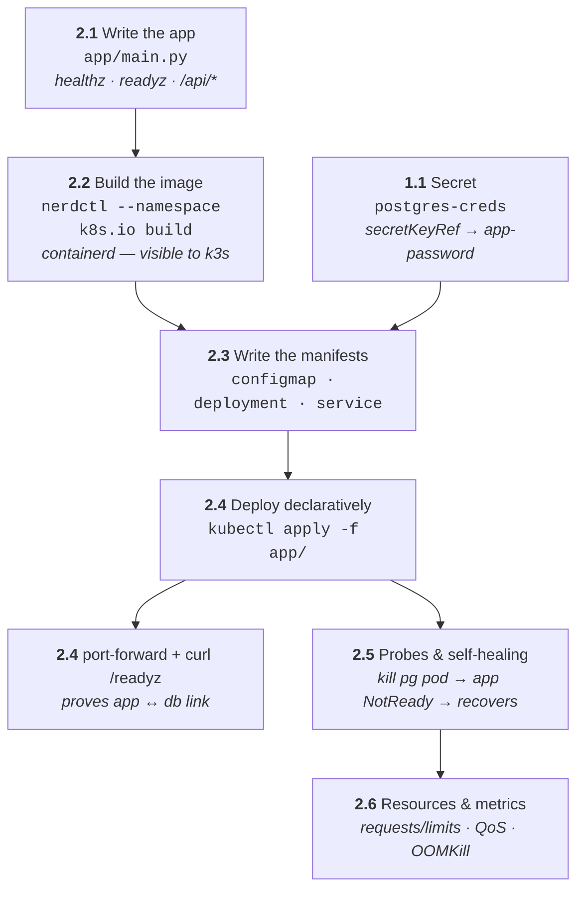
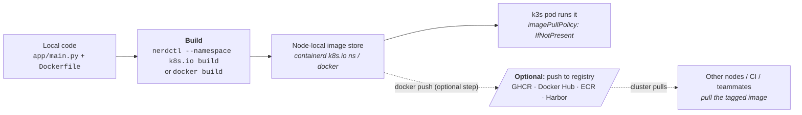
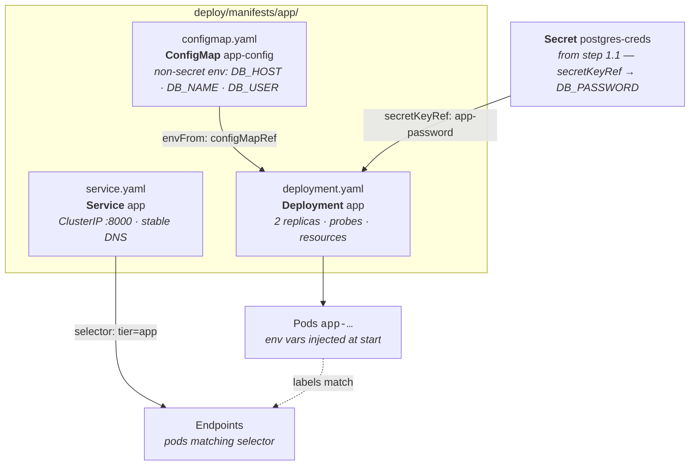

# Phase 2 — App Tier (Python / FastAPI)

What this phase builds: the FastAPI middleware that sits between the web tier
and Postgres — written, built into a local image, deployed declaratively with
config and secrets wired in, then hardened with probes and resource limits.



## 2.1 — Write the app

**Goals:** Build `app/main.py` — the middleware that talks to Postgres.

**Concepts:** Environment-driven config, health vs readiness semantics, `uv`
project workflow.

The app simulates the tutorial itself: it serves the curriculum as JSON and
tracks per-step completion in the `progress` table — checking off a step in
the web UI is the end-to-end proof all three tiers work. Dependencies are
managed by **uv** (`pyproject.toml` + `uv.lock`): FastAPI, pydantic,
pydantic-settings, psycopg.

Endpoints:

- `GET /healthz` — process alive (always 200)
- `GET /readyz` — runs `SELECT 1` against Postgres; fails if DB unreachable
- `GET /api/steps` — tutorial steps joined with completion state
- `GET /api/progress`, `POST /api/progress` — read/write the `progress` table

Config via env: `DB_HOST`, `DB_NAME`, `DB_USER`, `DB_PASSWORD` (from Secret).

The repo ships `app/main.py`, `pyproject.toml`, `uv.lock`, and a `Dockerfile`
— try it locally first:

1.  Install dependencies into a project venv:

    ```bash
    cd app && uv sync
    ```

    ??? info "INFO"

        ??? question "Why?"

            `uv sync` reads `uv.lock` and creates `.venv` with the exact
            pinned versions — same dependency set the Dockerfile installs.

        ??? info "Expected output"

            ```bash
            Resolved 25 packages ...
            Installed 25 packages in ...        # (1)!
            ```

            1.  Reproducible — `uv.lock` pins every transitive dep, like
                `Chart.lock` does for Helm.

2.  Run the app locally:

    ```bash
    uv run uvicorn main:app --reload --port 8000
    ```

    ??? info "INFO"

        ??? question "Why?"

            `uv run` executes inside the project venv without activating it;
            `--reload` restarts on file changes — the inner dev loop before
            any image builds.

        ??? info "Expected output"

            ```bash
            INFO:     Uvicorn running on http://127.0.0.1:8000   # (1)!
            INFO:     Application startup complete.
            ```

            1.  Serving locally. `/healthz` works standalone; `/readyz` and
                `/api/*` need Postgres — `kubectl port-forward
                svc/pg-postgresql 5432:5432` and `DB_HOST=localhost` bridges
                the running cluster DB to your local process.

3.  Sanity-check it:

    ```bash
    curl localhost:8000/healthz
    ```

    ??? info "INFO"

        ??? info "Expected output"

            ```bash
            {"status":"ok"}                         # (1)!
            ```

            1.  Same response shape the kubelet's liveness probe will check
                in step 2.5.

---

## 2.2 — Build the image (Rancher Desktop runtime caveat)

**Goals:** Get a locally-built image visible to k3s.

**Concepts:** Image build/push/pull lifecycle, `imagePullPolicy`, runtime
namespaces.



The solid path is what this tutorial uses — one node, local image. The dotted
path is what teams and CI/CD do — publish once, let every cluster pull it.

Run these in order. Expand **ⓘ INFO** under each command for the rationale and
expected output — the `+` markers explain every column and status.

1.  Build the app image — pick the tab matching your Rancher Desktop engine:

    === "containerd — nerdctl (default)"

        ```bash
        nerdctl --namespace k8s.io build -t k8s-tutorial-app:0.1.0 ./app
        ```

    === "dockerd (moby) — docker"

        ```bash
        docker build -t k8s-tutorial-app:0.1.0 ./app
        ```

    ??? info "INFO"

        ??? question "Why two different commands?"

            k3s stores images in containerd's **`k8s.io` namespace**. With
            Rancher Desktop on the default **containerd** engine, `nerdctl`
            must target that namespace explicitly — a plain `docker build`
            or unnamespaced `nerdctl` lands in a different store, and the
            cluster would hit `ImagePullBackOff` never seeing the image.

            On the **dockerd (moby)** engine, docker's image store *is*
            shared with k3s, so a normal `docker build` is all you need.
            (Check which engine you're on: Rancher Desktop → Settings →
            *Container Engine*.)

        ??? info "Expected output (trimmed)"

            ```bash
            # nerdctl (containerd)
            [+] Building 12.3s (10/10) FINISHED             # (1)!
             => exporting to oci image format
            unpackaging linux/arm64/v8 ...                   # (2)!

            # docker build (moby)
            [+] Building 12.3s (10/10) FINISHED
            => writing image sha256:…                        # (3)!
            ```

            1.  Buildkit progress — layers cached on rebuilds, so second runs
                are near-instant.
            2.  `unpackaging …` = the image landing in containerd's `k8s.io`
                namespace — the step that makes it visible to k3s.
            3.  Dockerd loads it into its own store — shared with k3s when
                the engine is moby.

        ??? failure "Got `no buildkit host is available` / `buildkitd` socket errors?"

            `nerdctl` builds via **buildkitd**, which lives inside Rancher
            Desktop's Lima VM — those `unix:///run/buildkit-*/buildkitd.sock`
            paths are *in the VM*, and this error means the daemon isn't
            answering. Check in order:

            1. **Engine choice** — Rancher Desktop → Settings → *Container
               Engine*. If it's set to **dockerd (moby)**, buildkit for
               nerdctl isn't running: use the docker tab above, or switch the
               engine to **containerd**.
            2. **buildkitd state in the VM:**

               ```bash
               rdctl shell sudo systemctl status buildkit     # inspect
               rdctl shell sudo systemctl restart buildkit    # bounce it
               ```

            3. **Still starting / wedged** — if Kubernetes was just enabled,
               give the VM a minute; otherwise quit and relaunch Rancher
               Desktop (or update it — older builds had buildkit bugs).

2.  Confirm the image landed where the cluster can see it:

    === "containerd — nerdctl (default)"

        ```bash
        nerdctl --namespace k8s.io images | grep k8s-tutorial
        ```

    === "dockerd (moby) — docker"

        ```bash
        docker images | grep k8s-tutorial
        ```

    ??? info "INFO"

        ??? question "Why?"

            sanity-checks the previous step before Kubernetes gets involved —
            if the tag shows here, `imagePullPolicy: IfNotPresent` in the
            Deployment will resolve it locally without touching a registry.
            Same check, whichever engine you used.

        ??? info "Expected output"

            ```bash
            k8s-tutorial-app    0.1.0    <image-id>    <size>   # (1)!
            ```

            1.  Image tagged `0.1.0` — in containerd's `k8s.io` namespace
                (nerdctl) or the shared docker store (moby). Empty output =
                wrong namespace/engine or the build didn't finish.

!!! success "Verify"
    `imagePullPolicy: IfNotPresent` + local tag → k8s uses the node-local image.

### Optional — publish the image to a registry

*Why bother:* a node-local build only exists on **your** machine. The moment
the cluster grows past one node — or CI/CD and teammates enter the picture —
pods must *pull* the image from somewhere shared. The real-world flow is:
**CI builds → tags → pushes to a registry → the cluster pulls.** This is
optional here (one node, local tag), but do it once to learn the pattern.

**Registry options:**

| Registry | Notes |
|----------|-------|
| **Docker Hub** | Simplest public option; pull rate limits apply. |
| **GHCR** (`ghcr.io`) | Free with GitHub — pairs naturally with Actions CI; `docker login ghcr.io` uses a PAT. |
| **ECR** | AWS's private registry — IAM-integrated; standard for EKS. |
| **ACR / GAR** | Azure Container Registry / Google Artifact Registry — the same role on AKS/GKE. |
| **Harbor** | Self-hosted open-source registry — RBAC, image scanning, replication; runs on k8s itself. |
| **GitLab CR / Quay** | GitLab's built-in registry / Red Hat's Quay.io (or self-hosted Quay). |

1.  Tag the image for the registry (GHCR shown — swap the prefix for yours):

    ```bash
    docker tag k8s-tutorial-app:0.1.0 ghcr.io/<your-user>/k8s-tutorial-app:0.1.0
    ```

2.  Log in and push:

    ```bash
    echo $GHCR_PAT | docker login ghcr.io -u <your-user> --password-stdin
    docker push ghcr.io/<your-user>/k8s-tutorial-app:0.1.0
    ```

    ??? info "INFO"

        ??? question "Why?"

            `docker login` stores registry credentials in
            `~/.docker/config.json`; `push` uploads the layers. Tag
            convention matters in CI — pin a version or git SHA
            (`:0.1.0`, `:sha-abc123`) rather than `latest`, so deploys are
            reproducible and rollbacks possible.

        ??? note "On nerdctl/containerd"

            Equivalent: `nerdctl login ghcr.io`, `nerdctl tag`,
            `nerdctl push` — same flow.

3.  Point the Deployment at the registry image:

    ```yaml
    # deploy/manifests/app/deployment.yaml
    image: ghcr.io/<your-user>/k8s-tutorial-app:0.1.0
    ```

    For **private** registries the cluster needs pull credentials:

    ```bash
    kubectl create secret docker-registry regcred \
      --docker-server=ghcr.io --docker-username=<you> \
      --docker-password=$GHCR_PAT
    ```

    then reference `imagePullSecrets: [{name: regcred}]` in the pod spec.
    (Managed platforms wire this automatically — EKS/GKE/AKS pull from their
    own registries via node IAM.)

---

## 2.3 — Write the app manifests

**Goals:** Author the three YAML manifests the Deployment step applies —
ConfigMap, Deployment, Service.

**Concepts:** manifest anatomy (`apiVersion`/`kind`/`metadata`/`spec`), labels
& selectors, `envFrom`/`secretKeyRef`, probes, resource requests/limits.

Each file goes under `deploy/manifests/app/`. The repo ships them already —
if you're building the tree yourself, create each one here.



1.  Create `deploy/manifests/app/configmap.yaml`:

    ```bash
    cat > deploy/manifests/app/configmap.yaml <<'EOF'
    apiVersion: v1
    kind: ConfigMap
    metadata:
      name: app-config
      labels: {app: k8s-tutorial, tier: app}
    data:
      DB_HOST: pg-postgresql
      DB_NAME: tutorial
      DB_USER: app_user
    EOF
    ```

    ??? info "INFO"

        ??? question "Why?"

            non-secret config lives in a ConfigMap — `DB_HOST` is the service
            DNS name from 1.4, `DB_NAME`/`DB_USER` the ones from 1.3. Keeping
            them here means changing env config = one manifest edit, not a
            code change + rebuild.

        ??? info "The manifest, annotated"

            ```yaml
            apiVersion: v1                              # (1)!
            kind: ConfigMap                             # (2)!
            metadata:
              name: app-config                          # (3)!
              labels: {app: k8s-tutorial, tier: app}    # (4)!
            data:
              DB_HOST: pg-postgresql                    # (5)!
              DB_NAME: tutorial
              DB_USER: app_user                         # (6)!
            ```

            1.  `v1` = the **core** API group — no group prefix needed
                (contrast with `apps/v1` on the Deployment).
            2.  The object kind — determines which fields `spec`/`data` accept.
            3.  The name the Deployment references in `envFrom.configMapRef` —
                they must match.
            4.  Labels are metadata for selection/organization — the Service
                and `-l tier=app` filters key off `tier: app`.
            5.  The Service DNS name from 1.4 — this string is what makes the
                app tier *find* Postgres.
            6.  Every `data` key becomes an env var in the pod —
                `DB_USER: app_user` = the least-privilege role from 1.3.

2.  Create `deploy/manifests/app/deployment.yaml`:

    ```bash
    cat > deploy/manifests/app/deployment.yaml <<'EOF'
    apiVersion: apps/v1
    kind: Deployment
    metadata:
      name: app
      labels: {app: k8s-tutorial, tier: app}
    spec:
      replicas: 2
      selector:
        matchLabels: {app: k8s-tutorial, tier: app}
      template:
        metadata:
          labels: {app: k8s-tutorial, tier: app}
        spec:
          containers:
            - name: app
              image: k8s-tutorial-app:0.1.0
              imagePullPolicy: IfNotPresent
              ports:
                - containerPort: 8000
              envFrom:
                - configMapRef: {name: app-config}
              env:
                - name: DB_PASSWORD
                  valueFrom:
                    secretKeyRef: {name: postgres-creds, key: app-password}
              readinessProbe:
                httpGet: {path: /readyz, port: 8000}
                periodSeconds: 5
              livenessProbe:
                httpGet: {path: /healthz, port: 8000}
                periodSeconds: 10
              resources:
                requests: {cpu: 50m, memory: 64Mi}
                limits: {cpu: 250m, memory: 256Mi}
    EOF
    ```

    ??? info "INFO"

        ??? question "Why?"

            the interesting fields — `image` is the tag you built in 2.2
            (`IfNotPresent` resolves it locally); `envFrom.configMapRef`
            injects **every** ConfigMap key as an env var while
            `secretKeyRef` injects just `app-password` from the 1.1 Secret
            (secrets stay granular — only what the container needs);
            `readinessProbe`/`livenessProbe` are exercised in 2.5;
            `resources` produces QoS class *Burstable*, inspected in 2.6.

        ??? info "The manifest, annotated"

            ```yaml
            spec:
              replicas: 2                                    # (1)!
              selector:
                matchLabels: {app: k8s-tutorial, tier: app}  # (2)!
              template:                                      # (3)!
                spec:
                  containers:
                    - name: app
                      image: k8s-tutorial-app:0.1.0          # (4)!
                      imagePullPolicy: IfNotPresent          # (5)!
                      ports:
                        - containerPort: 8000
                      envFrom:
                        - configMapRef: {name: app-config}   # (6)!
                      env:
                        - name: DB_PASSWORD
                          valueFrom:
                            secretKeyRef: {name: postgres-creds, key: app-password}  # (7)!
                      readinessProbe:
                        httpGet: {path: /readyz, port: 8000} # (8)!
                      livenessProbe:
                        httpGet: {path: /healthz, port: 8000}
                      resources:
                        requests: {cpu: 50m, memory: 64Mi}   # (9)!
                        limits: {cpu: 250m, memory: 256Mi}
            ```

            1.  Desired pod count — the Deployment controller keeps exactly
                this many running.
            2.  Which pods the Deployment owns — **must match**
                `template.metadata.labels` or the API rejects the manifest.
            3.  `template` is a **pod spec embedded in the Deployment** —
                everything under it is stamped onto each replica.
            4.  The tag you built in 2.2 — must match exactly or you'll get
                `ErrImagePull`.
            5.  `IfNotPresent` = use the node-local image (no registry pull).
                `Always` would try a registry that doesn't have it.
            6.  Injects **every** ConfigMap key as an env var —
                `DB_HOST`/`DB_NAME`/`DB_USER` appear in the container env.
            7.  Granular secret injection — only the `app-password` key of
                `postgres-creds`, as `DB_PASSWORD`. The app never sees the
                superuser password.
            8.  `/readyz` does the real `SELECT 1` — failing it drops the pod
                from Service endpoints without restarting (2.5's chaos test).
            9.  Requests reserve, limits cap — unequal values → QoS
                `Burstable` (2.6 inspects this).

3.  Create `deploy/manifests/app/service.yaml`:

    ```bash
    cat > deploy/manifests/app/service.yaml <<'EOF'
    apiVersion: v1
    kind: Service
    metadata:
      name: app
      labels: {app: k8s-tutorial, tier: app}
    spec:
      type: ClusterIP
      selector: {app: k8s-tutorial, tier: app}
      ports:
        - port: 8000
          targetPort: 8000
    EOF
    ```

    ??? info "INFO"

        ??? question "Why?"

            ClusterIP + `app` DNS name = the stable internal address the web
            tier proxies to in Phase 3. The `selector` must match the pod
            template's labels — that's how endpoints get populated.

        ??? info "The manifest, annotated"

            ```yaml
            spec:
              type: ClusterIP                                # (1)!
              selector: {app: k8s-tutorial, tier: app}       # (2)!
              ports:
                - port: 8000                                 # (3)!
                  targetPort: 8000                           # (4)!
            ```

            1.  Internal-only VIP — no external exposure. NodePort/
                LoadBalancer would be for direct outside access.
            2.  Selects which pods receive traffic — identical to the pod
                template labels in `deployment.yaml`. A mismatch silently
                yields an empty Endpoints list.
            3.  The port the **Service** listens on — what callers dial
                (`app:8000`).
            4.  The port kube-proxy forwards to **on the pod** — uvicorn's
                `containerPort`. `port` and `targetPort` can differ
                (e.g. svc :80 → pod :8000).

---

## 2.4 — Deploy + ConfigMap + Secret wiring

**Goals:** Deploy the app tier declaratively; separate config from code from
secrets.

**Concepts:** Deployment/ReplicaSet/pod hierarchy, `envFrom`/`secretKeyRef`,
`kubectl apply`, labels/selectors.

Applies the three manifests written in 2.3.

1.  Apply the app manifests:

    ```bash
    kubectl apply -f deploy/manifests/app/
    ```

    ??? info "INFO"

        ??? question "Why?"

            the first **declarative** deploy — a directory of YAML becomes
            the desired state, and `apply` create-or-updates each object.
            Non-secret config lands in the ConfigMap (`DB_HOST`, `DB_NAME`,
            `DB_USER`); the password comes from the `postgres-creds` Secret
            via `secretKeyRef` — config separated from secrets, both
            separated from code.

        ??? info "Expected output"

            ```bash
            configmap/app-config created
            deployment.apps/app created                # (1)!
            service/app created
            ```

            1.  `apply` on a directory creates each manifest — note the three
                kinds: ConfigMap, Deployment, Service.

2.  Watch the rollout reach readiness:

    ```bash
    kubectl rollout status deploy/app
    ```

    ??? info "INFO"

        ??? question "Why?"

            `apply` returns after the *spec* is accepted, not after pods are
            healthy — `rollout status` blocks until the Deployment reports
            Ready, and is where a bad image or env var surfaces immediately
            (it hangs instead of silently failing).

        ??? info "Expected output"

            ```bash
            Waiting for deployment "app" rollout to finish: ...   # (1)!
            deployment "app" successfully rolled out              # (2)!
            ```

            1.  Transient line while ReplicaSet pods come up — a *stuck* one
                here means CrashLoopBackOff or pending pods; check
                `get pods`/`describe` next.
            2.  All replicas updated and Ready.

3.  See the pods the Deployment owns:

    ```bash
    kubectl get pods -l tier=app -o wide
    ```

    ??? info "INFO"

        ??? question "Why?"

            `-l tier=app` filters by the label the manifests set — labels are
            how Deployments, Services, and NetworkPolicies find their pods.
            `-o wide` adds IPs and the node.

        ??? info "Expected output"

            ```bash
            NAME                  READY   STATUS    RESTARTS   AGE   IP          NODE
            app-6d8f9c…           1/1     Running   0          1m    10.42.0.x   lima-rancher-desktop  # (1)!
            ```

            1.  Random suffix = ReplicaSet-managed pod name (contrast with
                the StatefulSet's stable `-0` ordinal).

4.  Follow the app logs:

    ```bash
    kubectl logs -f deploy/app
    ```

    ??? info "INFO"

        ??? question "Why?"

            `logs deploy/app` follows the *Deployment* — kubectl picks a pod
            from it, so you don't chase random pod names. `-f` streams new
            lines live.

        ??? info "Expected output"

            ```bash
            INFO:     Started server process
            INFO:     Uvicorn running on http://0.0.0.0:8000      # (1)!
            ```

            1.  FastAPI/Uvicorn banner — the app is serving inside the pod.

5.  Bridge the service to localhost:

    ```bash
    kubectl port-forward svc/app 8000:8000 &
    ```

    ??? info "INFO"

        ??? question "Why?"

            `port-forward` tunnels `localhost:8000` through the API server
            straight to the Service — no ingress needed. `&` backgrounds it
            so the terminal stays free (kill it later with `kill %1` or
            `jobs`/`fg`).

        ??? info "Expected output"

            ```bash
            Forwarding from 127.0.0.1:8000 -> 8000    # (1)!
            ```

            1.  Tunnel is live; keep the shell open or it dies with the
                process.

6.  Prove the app↔DB link end to end:

    ```bash
    curl localhost:8000/readyz
    ```

    ??? info "INFO"

        ??? question "Why?"

            `/readyz` executes `SELECT 1` against Postgres — a `200` with
            `{"db":"ok"}` traverses *everything*: port-forward → Service →
            app pod → DNS (`pg-postgresql` service) → DB pod.

        ??? info "Expected output"

            ```bash
            {"db":"ok"}                               # (1)!
            ```

            1.  DB reachable through the service DNS name — the first real
                cross-tier proof.

7.  Bonus — logs from a *previous* container instance:

    ```bash
    kubectl logs deploy/app --previous
    ```

    ??? info "INFO"

        ??? question "Why?"

            after a crash-restart, current logs show only the new container —
            `--previous` gets the dead one's output, which is where the
            actual crash reason lives.

        ??? info "Expected output"

            The crashed container's last lines — or `Error from server
            (BadRequest): previous terminated container ... not found` if the
            pod never restarted. That error is *good news*: it means no
            crash happened.

!!! success "Verify"
    `/readyz` returns DB-connected JSON through the port-forward.

---

## 2.5 — Probes & self-healing

**Goals:** Make k8s detect and route around failure.

**Concepts:** readiness vs liveness vs startup probes, `restartPolicy`, events.

1.  See the probes the Deployment defines:

    ```bash
    kubectl describe pod -l tier=app | grep -B2 -A8 -Ei 'liveness|readiness'
    ```

    ??? info "INFO"

        ??? question "Why?"

            probes are declared in the pod spec — `describe` shows what
            kubelet checks (readiness gates Service traffic; liveness
            restarts the container). The grep pattern keys off the field
            names — the spec lines say `Liveness:`/`Readiness:`, not the
            word "probe".

        ??? info "Expected output (trimmed)"

            ```bash
            Liveness:   http-get http://:8000/healthz delay=0s period=10s  # (1)!
            Readiness:  http-get http://:8000/readyz  delay=0s period=5s   # (2)!
            ...
            Events:
              Warning  Unhealthy  28m (x2 over 28m)  kubelet  Readiness probe failed:
                Get "http://10.42.0.20:8000/readyz": dial tcp …: connect: connection refused  # (3)!
            ```

            1.  Liveness failing → kubelet *restarts* the container.
            2.  Readiness failing → pod drops out of Service endpoints but
                keeps running — the distinction the next commands exploit.
            3.  **Benign if old/bounded** — `x2 over 28m` means the probe
                fired before uvicorn had bound port 8000. That's a startup
                race, fixed in real deployments with `initialDelaySeconds`
                or a `startupProbe`. Worry only if it's recent *and* the pod
                isn't `1/1 Running` — then it's a wrong port/path or a dead
                app.

        ??? failure "Pod stuck `0/1` with ongoing `connection refused`?"

            Then it's not a startup race — the app isn't listening where the
            probe looks. Check `kubectl logs deploy/app` for a crash or a
            different bind port, and confirm `containerPort`/`targetPort`
            match the app's actual port (8000).

2.  Chaos test — kill the database pod:

    ```bash
    kubectl delete pod pg-postgresql-0
    ```

    ??? info "INFO"

        ??? question "Why?"

            a controlled failure to *watch* the self-healing chain: DB pod
            dies → app's `/readyz` starts failing → app goes `NotReady` and
            exits endpoints → StatefulSet recreates `pg-postgresql-0` → app
            recovers. No human touched the app.

        ??? info "Expected output"

            ```bash
            pod "pg-postgresql-0" deleted             # (1)!
            ```

            1.  The StatefulSet controller immediately starts a replacement
                with the *same* name — ordered, stable identity in action.

3.  Watch readiness flip in real time:

    ```bash
    kubectl get pods -w
    ```

    ??? info "INFO"

        ??? question "Why?"

            `-w` streams the transition — `app` goes `0/1 Ready` (can't serve
            without its DB) while `pg-postgresql-0` recreates.

        ??? info "Expected output"

            ```bash
            pg-postgresql-0   1/1   Terminating   0   10m       # (1)!
            app-…             0/1   Running       0   5m        # (2)!
            pg-postgresql-0   0/1   Running       0   3s
            app-…             1/1   Running       0   6m        # (3)!
            ```

            1.  DB pod terminating.
            2.  App `0/1` — *running but NotReady*: readiness probe failing
                removes it from endpoints without restarting it.
            3.  Both back — recovery is automatic.

4.  Read the story via events:

    ```bash
    kubectl get events --sort-by=.lastTimestamp
    ```

    ??? info "INFO"

        ??? question "Why?"

            events are the cluster's narration — kill, reschedule, probe
            failures, recovery — sorted chronologically to read as a
            timeline.

        ??? info "Expected output (trimmed)"

            ```bash
            Normal   Killing           pod/pg-postgresql-0   Stopping container  # (1)!
            Warning  Unhealthy         pod/app-…             Readiness probe failed
            Normal   Started           pod/pg-postgresql-0   Started container
            Normal   …                 endpoints/app         (endpoints updated)   # (2)!
            ```

            1.  The kill lands first.
            2.  Readiness failures, then endpoint re-add — the full loop.

!!! success "Verify"
    App pod returns to `Ready` automatically once postgres is back. Readiness
    removes it from Service endpoints — traffic never hits a broken pod.

---

## 2.6 — Resources & metrics

**Goals:** Right-size workloads; observe actual usage.

**Concepts:** requests vs limits, QoS classes (Guaranteed/Burstable/BestEffort),
OOMKill, metrics-server.

1.  Read actual CPU/memory usage:

    ```bash
    kubectl top nodes && kubectl top pods -n tutorial
    ```

    ??? info "INFO"

        ??? question "Why?"

            `top` reads live metrics from **metrics-server** — the real
            usage, vs the *declared* requests/limits in the spec. The gap
            between the two is how you right-size.

        ??? info "Expected output"

            ```bash
            NAME                   CPU(cores)   MEMORY(bytes)     # (1)!
            lima-rancher-desktop   210m         1250Mi
            NAME                   CPU(cores)   MEMORY(bytes)
            app-…                  3m           45Mi              # (2)!
            pg-postgresql-0        15m          120Mi
            ```

            1.  `m` = millicores (1000m = 1 CPU); `Mi` = mebibytes.
            2.  Actual usage is usually far below requests — that slack is
                what limits are for. `metrics-server` missing →
                `error: Metrics API not available` (Rancher Desktop ships it).

2.  Check the pod's QoS class:

    ```bash
    kubectl describe pod -l tier=app | grep QoS
    ```

    ??? info "INFO"

        ??? question "Why?"

            QoS class derives from requests/limits: **Guaranteed** (equal
            req=limit on every resource) > **Burstable** (some set) >
            **BestEffort** (none). Under node pressure, eviction order is
            BestEffort → Burstable → Guaranteed.

        ??? info "Expected output"

            ```bash
            QoS Class:                   Burstable     # (1)!
            ```

            1.  Requests or limits set but not equal — protected-ish, but
                evictable before Guaranteed pods.

3.  OOMKill drill — evidence of a memory limit breach:

    ```bash
    kubectl get events --field-selector reason=OOMKilled
    ```

    ??? info "INFO"

        ??? question "Why?"

            setting a tiny memory limit is the classic way to see Kubernetes
            enforce limits: the kernel kills the container, kubelet logs an
            `OOMKilled` event, and `restartPolicy` restarts it. `--field-selector`
            filters events server-side instead of grepping everything.

        ??? info "Expected output"

            ```bash
            LAST SEEN   TYPE      REASON      OBJECT        MESSAGE
            2m          Warning   OOMKilled   pod/app-…     … memory cgroup …   # (1)!
            ```

            1.  A pod over its `limits.memory` gets killed — `RESTARTS` in
                `get pods` ticks up and the reason shows in `describe`'s
                `Last State`. Empty output here = no OOMKills yet — good.

!!! success "Verify"
    You can read `requests`/`limits` in a pod spec and predict its QoS class.
